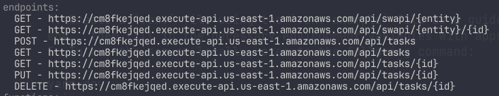

# CRUD Project with AWS Lambda, TypeScript, Node, and Serverless Framework

## Description
This project is a basic CRUD (Create, Read, Update, Delete) application developed using AWS Lambda, TypeScript, Node.js, and the Serverless Framework. It allows performing basic operations on a database using serverless functions.

## Technologies Used
- AWS Lambda
- TypeScript
- Node.js
- Serverless Framework

## Installation Instructions
1. Clone this repository to your local machine.
2. Install dependencies using the following command:
```
yarn 
```
3. Install Serverless globally using the following command:
```
npm install -g serverless
```
4. Create a `.env` file using the `.env-example` file as a guide. You can copy the `.env-example` file and rename it to `.env`, then fill in the necessary environment variables with appropriate values.
5. To run the server locally, execute the following command:
```
yarn dev 
```
6. To run tests, use the following command:

```
yarn test 
```
7. To deploy the project to AWS, execute the following command:
```
yarn deploy

```


## To try endpoints
### Base URL
https://cm8fkejqed.execute-api.us-east-1.amazonaws.com


#### SWAPI Entity Endpoint
Method: GET
Endpoint: /api/swapi/entity/{entity}
Description: This endpoint retrieves records based on the entities provided. The following entities are permitted:
- **"films"**
- **"people"**
- **"planets"**
- **"species"**
- **"starships"**
- **"vehicles"**

Example: To retrieve records for films, make a GET request to /api/swapi/entity/films.

#### SWAPI Entity by ID Endpoint (Retrieve Record by Entity and ID)
Method: GET
Endpoint: /api/swapi/entity/{entity}/{id}
Description: This endpoint retrieves a specific record based on the entity and ID provided.
Parameters:
- **{entity}: The entity type (e.g., "films", "people", etc.).**
- **{id}: The ID of the entity record.**
Example: To retrieve a specific film record with ID 1, make a GET request to /api/swapi/entity/films/1.

#### Get All Tasks Endpoint
- **Method**: GET
- **Endpoint**: /api/tasks
- **Description**: This endpoint retrieves all tasks from the database.
- **Example**: To retrieve all tasks, make a GET request to `/api/tasks`.

#### Get Task by ID Endpoint
- **Method**: GET
- **Endpoint**: /api/tasks/{id}
- **Description**: This endpoint retrieves a specific task from the database based on its ID.
- **Parameters**:
  - `{id}`: The ID of the task.
- **Example**: To retrieve a task with ID 1, make a GET request to `/api/tasks/1`.

#### Add Task Endpoint
- **Method**: POST
- **Endpoint**: /api/tasks
- **Payload Type**: application/json
- **Payload**:
```json
{
  "title": "Task Title",
  "description": "Task Description"
}

```
Description: This endpoint allows you to add a new task to the database.

### Update Task Endpoint
- **Method**: PUT
- **Endpoint**: /api/tasks/{taskId}
- **Payload Type**: application/json
- **Payload**:
```json
{
  "done": true,
  "title": "Updated Task Title",
  "description": "Updated Task Description"
}
```
Description: This endpoint allows you to update an existing task in the database. You can specify which fields to update, including marking the task as done, updating the title, or modifying the description.

#### Delete Task Endpoint
- **Method**: DELETE
- **Endpoint**: /api/tasks/{id}
- **Description**: This endpoint deletes a specific task from the database based on its ID.
- **Parameters**:
  - `{id}`: The ID of the task to delete.
- **Example**: To delete a task with ID 1, make a DELETE request to `/api/tasks/1`.